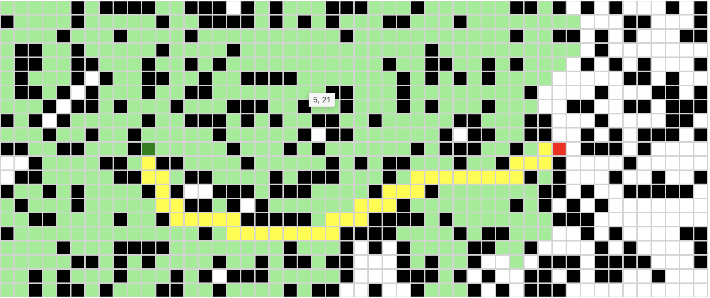

1.modal悬浮窗方式的Walker管理界面

如果第一次进入：（钱包地址未查询到NFT），则scroll执行，显示狗狗，然后mint，自动进入游戏

如果第二次进入：（钱包查询到一个或者多个NFT），则显示多个walker信息，修改walker名称，显示walker功勋；

选择walker进入游戏（需要手动选择），modal框会自动弹出（若有多个nft）

2.打字效果

改造所有显示文字的方式，实现打字效果

3.初始化部分提升性能

学习useEffect部分，useRef，快速获取被改变的useState设置，从而不需要查询多次

对于进入网页后的初始化，以及第二次进入后的初始化提升性能，尝试从localStorage快速获取，当用户点击刷新后，可以再真正获取

4.用户模型设计

一个用户（玩家）可以有多个Walker（游戏人物）

每个Walker可以设置自己的Name属性（目前名称不唯一，不过也不是多人游戏）

每个Walker出生后（mint）有自己的随机六属性（未实现，需要建立属性合约，猜测是1155包含多个NFT+ERC20方式？）

尝试定义这些合约，做实验

Walker可以打死Boss获取功勋值（大小Boss都算），每局计算一次，移动一格；Boss随机，小怪不是Boss，打死Boss后增加功勋

5.地图设计+进度设计/关卡仪式感设计

实现类似这样地图

一局一格，最终BOSS打死，怎么也得玩一两个小时吧？

6.道具模型和用户模型以及战斗计算

增加攻击、增加防御，先做这两个道具效果

例如一把刀，一个盾牌（先只能携带一刀一盾，仓库晚点开发）

Attack：3

Deffense：2

用户模型六属性：

| Strength     | 力量 | 3    |
| ------------ | ---- | ---- |
| Dexterity    | 敏捷 | 9    |
| Constitution | 体质 | 5    |
| Intelligence | 智力 | 10   |
| Charisma     | 魅力 | 1    |
| Lucky        | 幸运 | 4    |

战斗中计算：

初期仓库存本地，后期是物料、金币等ERC20+装备NFT存链上，上线后加载这些，形成仓库？

1.查看walker携带的刀、盾（只能携带一个，后面查看仓库中装备状态的刀盾或者更多装备）

2.查看属性并记录，目前就是（敏捷+体力+智力）/3=基础攻击力，每局固定消耗2体力？体力不是属性，是靠时间恢复的

3.随机小怪中要设置怪的攻击力和生命值，在json中设置，例如Slime，攻击力随机范围3-5（每个slime是固定），生命条随机8-10

4.大小Boss除了攻击力随机范围（可以单局、单次攻击固定）、生命条（可以随机范围或者固定）之外，还有防御力（另外一个条）

5.打斗除了文案描述外，每次要计算并输出

例如你攻击力为3，砍了Slime一刀，slime生命减少3

slime冲你吐吐沫，你被伤害了2（体力扣减2？，默认每个walker体力值一样，都是10？未来可以有加体力的装备？）

你攻击了slime，DPS高，砍了两刀，伤害6，slime死了

你获得了一个木头，捡起来放入了背包

7.道具划分和发行

道具可以讨论下，先简单，再复杂（例如引入装备图片和穿搭图片后）

传统游戏道具划分灰色、白色、蓝色、黄色、传奇（暗金色、橙色）

灰色、白色为随机掉落，一般打boss或者在一局格子中捡到；无限量，增加1-5攻击力，或者增加1-5防御力，duration是5格（5局后自然就损毁了）

彩色装备是单独的NFT，需要mint，游戏中方式可以选择到达一定功勋后，兑换限量的NFT

目前我们合约要确定数量，所以先发行蓝色装备，这个合约要讨论，是loot那样，套装发布，还是和传统游戏中一样，刀剑，防御，盔甲，项链等等，都是独立的；

发行蓝色装备，要限量发行，合约中注明；

另外，装备发行哪些？：头盔、肩膀、项链、衣服、手套、护腕、戒指左、戒指右、腰带、裤子、鞋子、单手、副手

8.基于webassembly的游戏前端引擎以及和链上交互规则流程

涉及复杂的装备和walker属性的计算，需要的游戏引擎

目前先跑通，粗粗划分边界，确定引擎职责，边做边摸索

目前边界是

1.所有和数字计算相关的，交给引擎负责

2.所有和存储链上数据相关的，交给引擎负责

3.获取链上数据引擎不负责

